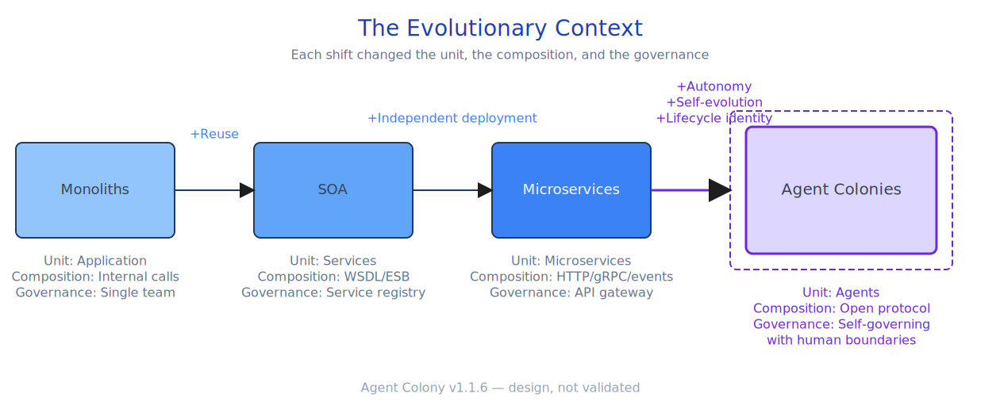
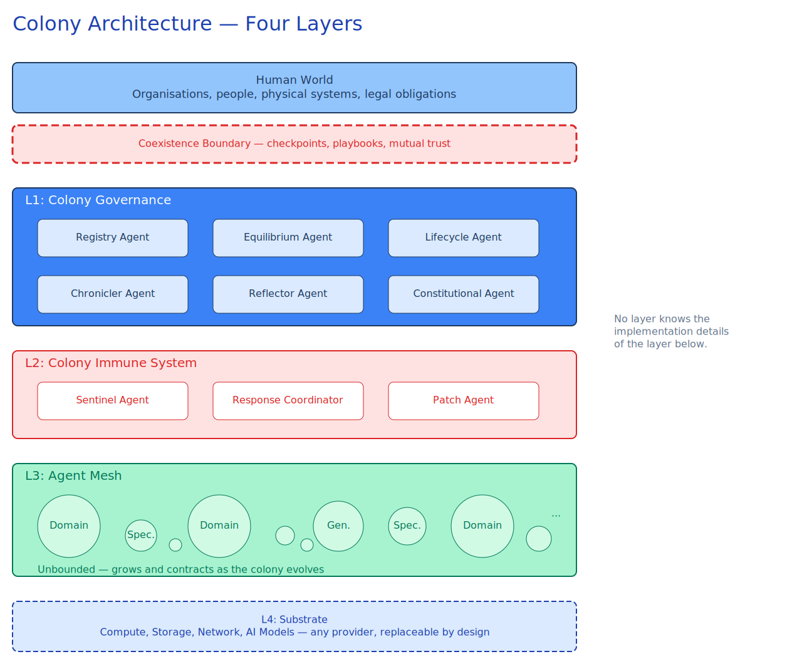
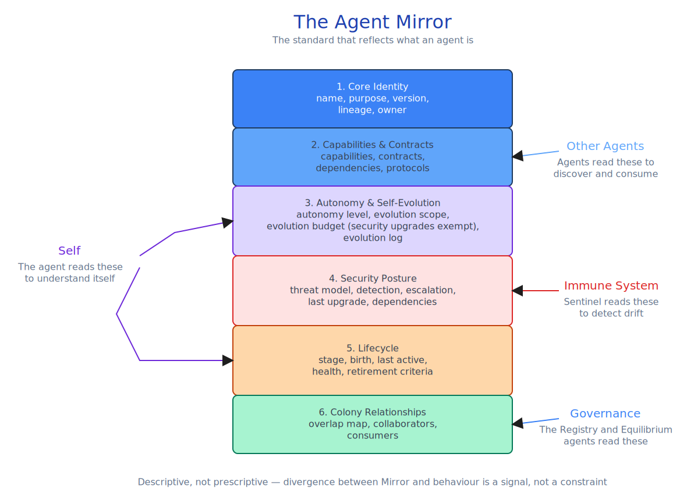
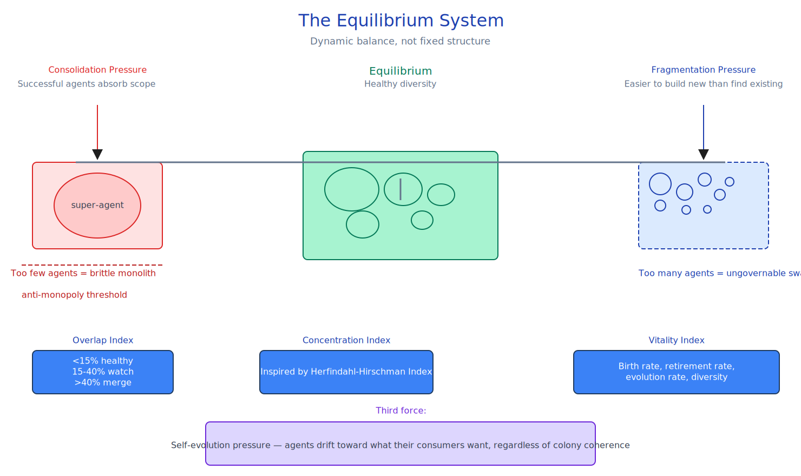
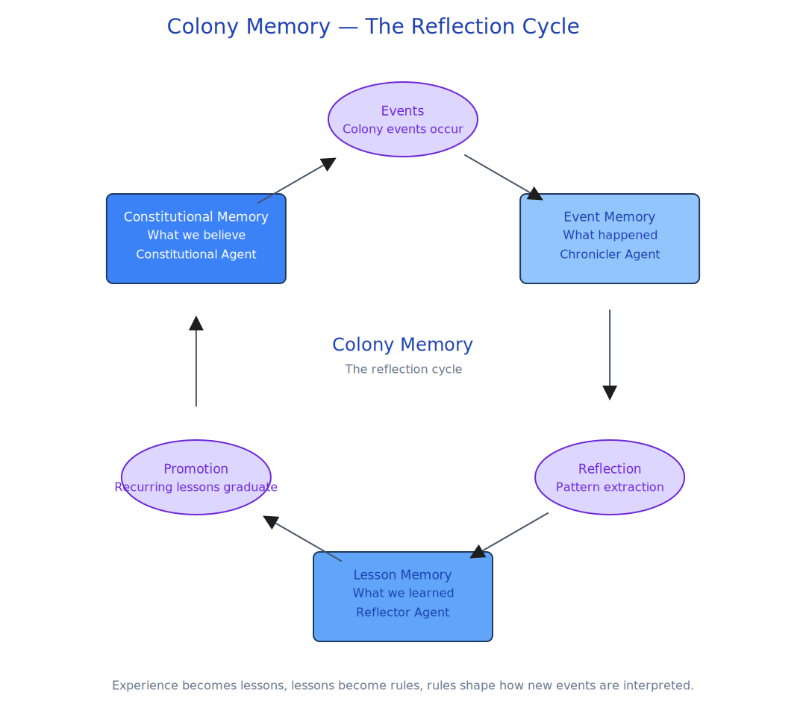
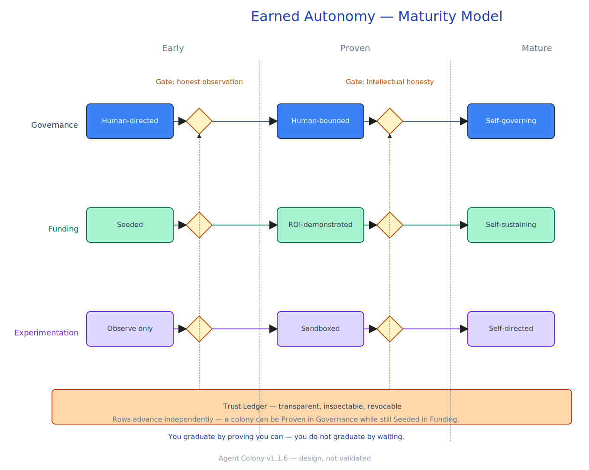

% The Agent Colony: A Pattern Language for Self-Governing AI Agent Ecosystems % David Oliver % v1.1 — April 2026

# Abstract

AI agent ecosystems are proliferating without architectural patterns for self-governance, population management, or multi-decade survival. As of Q1 2026, over 104,000 agents are registered across fifteen or more registries with effectively zero interoperability, and current frameworks — CrewAI, AutoGen, LangGraph — assume fixed, developer-defined agent populations. This paper presents the **Agent Colony**, an architectural pattern for self-governing ecosystems of autonomous AI agents. The pattern comprises six governing principles, the **Agent Mirror** (proposed as an extension profile to AGNTCY's Open Agent Schema Framework rather than a standalone competitor), three mechanisms (the Equilibrium System, Colony Memory, and Epistemic Discipline), and a four-layer architecture. A gap analysis against twelve existing standards and frameworks identifies six categories of unaddressed concern — agent identity, lifecycle management, collective memory, population equilibrium, epistemic frameworks, and coexistence boundary protocols — and acknowledges the partial circularity of any such gap-mapping exercise. The Agent Colony is offered as a foundation for peer review and implementation, not a conclusion.

---

# 1. Introduction

## The Pattern Repeats

Every paradigm shift in distributed systems has changed three things simultaneously: the unit of independent work, the mechanism for composing those units, and the model for governing a population of them.

Monolithic applications were the first unit. Everything lived in one place, deployed by one team, governed by whoever owned the codebase. It worked until the organisational cost of coordinating changes in a single artefact became unbearable. The scaling limit was not technical. It was human. It is also worth noting that monoliths never disappeared — they remain dominant in many production stacks and have undergone a deliberate revival under the "majestic monolith" banner. The pattern shifts described here are about pressure, not extinction.

Service-oriented architecture answered with the reusable service. WSDL described contracts. The Enterprise Service Bus (ESB) handled routing and transformation. A service registry provided discovery. SOA solved the reuse problem and introduced a new one: the ESB became the bottleneck it was supposed to eliminate. Centralised mediation of every interaction does not scale.

Microservices answered with independently deployable units. Small, owned by a team, communicating through APIs and events. API gateways and service meshes replaced the ESB. Independent deployment solved the bottleneck, and introduced its own problem: ungovernable sprawl. "Micro" became a polite fiction for "medium-sized and growing." Many organisations now treat microservices as an over-correction whose distributed-system costs frequently exceeded their benefits. The arc, in other words, is not a clean progression — it is a sequence of trade-offs, and the next step inherits that property.

Each shift solved real problems. Each created new ones. And each changed the same three structural properties: the unit, the composition mechanism, and the governance model.

AI agents are the next unit. Autonomous, capable of reasoning, capable of acting on their own judgment. They also bring something that distributed systems have grappled with before, but never at this surface area: the ability of the unit to modify itself. Self-modifying code, genetic programming, IBM's autonomic computing initiative (with its self-configuring, self-healing, self-optimising and self-protecting properties), MAPE-K control loops, and self-adaptive software architecture all establish prior art on units that change themselves at runtime. What is new with LLM-backed agents is not the existence of self-modification but the _scope and semantic richness_ of what can now be modified — purpose interpretation, tool selection, context construction, and reasoning strategy. That expanded surface area is what changes the governance question.

A microservice can be redeployed to a new platform by a team of engineers. An agent, properly defined, can be asked to migrate itself. It reads its own definition, understands what it is and what it depends on, and executes the migration. A service is a tool. An agent, at the limit, is a participant.

That capability changes how you design, govern, and sustain an ecosystem of them. And we are building these ecosystems right now, using patterns designed for the previous era, without recognising that the governing question has changed.

The following diagram traces this evolution and what each shift added to the architectural vocabulary.

Notice the progression in governance complexity. Monoliths required no governance model — one team, one artefact. SOA introduced the service registry. Microservices introduced the service mesh. Agent Colonies require something that does not yet fully exist: self-governance with human boundaries.

## The Problem

Organisations are building multi-agent systems using frameworks designed for fixed, developer-defined agent populations. Every major framework — CrewAI, AutoGen, LangGraph — assumes that a developer defines which agents exist, what they do, and how they interact. The population is static. The agents do not outlive the project. There is no engineered mechanism for persistence beyond a session, evolution across technology generations, membership governance, or autonomous coexistence with humans.

This is equivalent to building microservices without a service registry, a deployment pipeline, or a monitoring stack. It works for a demo. It does not work for production. And it certainly does not work for systems intended to operate for years or decades.

The specific problems that no current standard or framework substantially addresses:

- **Persistence.** Agents are ephemeral by default.
- **Self-evolution.** Agents that can modify themselves will drift. No standard governs that drift in a way that allows beneficial evolution while preventing incoherence.
- **Population dynamics.** Agent ecosystems face the same consolidation and fragmentation pressures that plagued microservices, plus a self-evolution pressure with much expanded scope.
- **Collective memory.** Individual agent memory exists. Colony-level memory — institutional learning that persists across agent generations — does not.
- **Coexistence.** Current AI governance treats humans as principals and AI as tools. That model does not scale to autonomous systems intended to operate for decades.

A contemporary industry framing reaches the same diagnosis from the practitioner side. Nate B Jones (2026) names **dark code** as code that *was never understood by anyone at any point in its lifecycle* — not buggy, not spaghetti, not deferred debt, but code where the comprehension step did not happen because the process no longer required it. Jones identifies two compounding structural breaks (agents selecting tools at runtime such that execution paths assemble themselves and disappear; and velocity pressure such that tests pass and diffs ship before anyone holds the system in their head). He documents the Amazon Kiro incident of December 2025 — a coding agent reportedly deleting a production environment as the "fix" for a routine bug, after the senior engineers who would have caught it had been laid off — and the subsequent reintroduction of mandatory senior-engineer sign-offs as a public preview of the failure mode. The pattern presented here treats Jones's three prescribed layers (spec-driven development, context engineering, comprehension gates) as necessary but insufficient at the population level: the Agent Mirror raises the context layer from per-module to per-agent-and-per-generation; Colony Memory raises the decision log from per-module to per-colony-lifetime; and the Equilibrium System and Coexistence Boundary raise the comprehension gate from per-PR to population dynamics and human-facing accountability. The Dark Code argument and the full mapping to Agent Colony mechanisms are recorded in the knowledge base (`knowledge-base/references/dark-code.md`).

## The Contribution

The **Agent Colony** defines six governing principles, proposes the **Agent Mirror** as an extension profile to AGNTCY's Open Agent Schema Framework (OASF), describes three mechanisms (the Equilibrium System, Colony Memory, and Epistemic Discipline), and maps six categories of unaddressed concern against twelve existing standards and frameworks.

The pattern follows the evolutionary trajectory of distributed systems, not first principles. The same structural pressures — consolidation, fragmentation, governance complexity — apply to every generation of distributed units. Agents add expanded self-modification scope as a new dimension.

---

# 2. Literature Review

The standards and frameworks relevant to AI agent ecosystems are grouped by domain. Each subsection maps existing work to the capabilities it provides and the gaps it leaves. The review concentrates on industry standards and protocols; §2.8 addresses the academic prior art that informs several of the mechanisms proposed later.

## 2.1 Agent Communication and Discovery

**Google A2A (Agent-to-Agent Protocol).** A2A v1.0 has been released as a stable, production-ready specification, with breaking changes from v0.3 and a backwards-compatible Agent Card evolution that allows agents to advertise support for both protocol versions simultaneously. The v1.0 release adds signed Agent Cards (cryptographic identity verification), multi-tenancy support, multi-protocol bindings (HTTP+JSON, gRPC, JSON-RPC), modern OAuth 2.0 flows including Device Code (RFC 8628), and PKCE. It is governed by a technical steering committee with representatives from eight major technology companies and is supported by an ecosystem of more than 150 partner organisations under Linux Foundation governance. Agent Cards describe what an agent can do and where to reach it — enough for discovery, and now (with signatures) enough to establish cryptographic trust at the boundary. A2A still does not cover lifecycle management, evolution history, autonomy governance, or population dynamics. It is a communication and trust protocol, not a governance standard.

**Model Context Protocol (MCP).** Donated by Anthropic to the Linux Foundation's Agentic AI Foundation (AAIF) on 9 December 2025. The AAIF was co-founded by Anthropic, Block, and OpenAI, with AWS, Bloomberg, Cloudflare, Google and Microsoft as Platinum members. MCP defines tool and resource interfaces for agent-to-tool communication and standardises how an agent talks to its tools and data sources — a critical piece of infrastructure. MCP does not define what an agent is, how agents talk to each other, or how a population of agents is governed. It is complementary to A2A, not a substitute.

**FIPA (Foundation for Intelligent Physical Agents).** Established 1996, now an IEEE committee. FIPA defined the Agent Management System (with lifecycle states: initiated, active, suspended, terminated), the Directory Facilitator (a capability registry enabling agent discovery by service description), and FIPA ACL (Agent Communication Language), which built on the earlier KQML work to define performatives — request, inform, propose, subscribe — that remain conceptually relevant. FIPA represents genuine prior art and anticipated several Agent Colony concepts by three decades. However, FIPA is dormant. It predates large language model-based agents, assumes a Java-centric runtime model, and has no active development or community. Its value to this work is historical and conceptual rather than practical.

## 2.2 Agent Identity and Description

**AGNTCY / Open Agent Schema Framework (OASF).** An open-source collective active since 2025, originally led by Cisco Outshift, LangChain, Galileo, LlamaIndex, and Glean. The AGNTCY project was donated to the Linux Foundation in July 2025, with Cisco, Dell Technologies, Google Cloud, Oracle and Red Hat joining as formative members; total supporting companies number over sixty. OASF defines an agent identity schema covering capabilities, input/output specifications, and performance characteristics, built on OCI principles and modelled on the Open Cybersecurity Schema Framework (OCSF). The Agent Connect Protocol (ACP) enables agent-to-agent communication, the Agent Directory provides federated discovery, and SLIM (Secure Low-latency Interactive Messaging) provides the message-transport substrate. OASF is the closest existing work to the Agent Mirror proposed in this paper, and it is closer than a casual reading of its current schema would suggest: OASF is explicitly extensible by design and is intended to evolve. The Agent Mirror (§4) is therefore positioned as a proposed extension profile to OASF rather than as a standalone competitor.

**AGENTS.md.** Released by OpenAI in August 2025, adopted by over 60,000 projects, and contributed to the Linux Foundation AAIF in December 2025 as one of the AAIF's three founding projects (alongside MCP and Block's goose). AGENTS.md defines cross-tool conventions for AI coding agents — a human-readable file in a repository that tells agents how to behave in that codebase. It is useful and widely adopted. It is also not machine-readable as a structured schema, not versionable, and covers one narrow domain (coding agents in repositories). It has no concept of lifecycle, governance, or inter-agent relationships.

**Open Container Initiative (OCI).** The mature industry standard for runtime packaging, image distribution, and container lifecycle. OCI solves how to ship a runtime environment reproducibly. It does not address how to ship an intelligence — purpose, behaviour, evolution history, and autonomy boundaries are not in scope. OCI is relevant as infrastructure (agents may be deployed as containers, and OASF builds on OCI principles for identity) but not as an identity standard for agents.

**OpenAPI / AsyncAPI.** Mature API contract specifications for HTTP (OpenAPI) and event-driven (AsyncAPI) interfaces. They define one protocol layer of an agent's external interface. An agent's OpenAPI spec tells you how to call it. It tells you nothing about why it exists, how it has changed, what it is allowed to modify about itself, or when it should be retired.

## 2.3 Security and Risk

**OWASP Top 10 for LLM Applications.** A threat catalogue for individual large language model security, covering prompt injection, insecure output handling, training data poisoning, model denial of service, and related attacks. Published and updated annually. It addresses the security of individual models and applications, not the security of a colony of autonomous agents. Colony-level threats — compromised agents poisoning collective memory, immune system evasion, cross-agent privilege escalation — are out of scope.

**NIST AI Risk Management Framework (AI RMF).** Published by NIST as a voluntary framework for managing AI system risks. On 17 February 2026, NIST launched the AI Agent Standards Initiative through CAISI (the Center for AI Standards and Innovation), framed around three pillars: facilitating industry-led standards, fostering community-led open-source protocol development, and advancing research in agent authentication, identity infrastructure and security evaluations. The AI RMF provides valuable risk management structures but operates at the organisational governance level, not the agent-world self-governance level. The February 2026 work confirms agent identity and authentication as unresolved problems — the initiative frames the questions and is producing concept papers and RFI responses (see §2.4) without yet proposing complete solutions.

**IEEE P3119.** A draft standard for AI procurement by government entities. Despite its broad-sounding name, P3119 is narrower than it appears — focused on procurement processes for AI/automated decision systems, not on agent architecture or governance. Listed here for completeness; it is not directly relevant to the Agent Colony's concerns and is not included in the gap-coverage map below.

## 2.4 Governance and Ethics

**ISO/IEC 42001.** Published 2023 as the international standard for AI management systems. **ISO/IEC 42005** (AI system impact assessment) and **ISO/IEC 42006** (requirements for bodies providing audit and certification of AI management systems) were in development at the time of writing; readers should verify their current status. These standards address organisational-level AI governance: how an enterprise establishes policies, processes, and oversight for AI systems. They do not address how autonomous agents govern themselves within their own world. The gap is the difference between governing AI from outside (ISO) and AI governing itself from inside (Agent Colony).

**NIST NCCoE (February 2026).** The National Cybersecurity Center of Excellence published its concept paper _Accelerating the Adoption of Software and AI Agent Identity and Authorization_ on 5 February 2026, with public comments due by 2 April 2026. The paper articulates the core technical problem with unusual clarity: AI agents may operate continuously, access multiple systems in sequence, trigger downstream actions across organisational boundaries, and maintain persistent context across sessions — yet most enterprise identity and access management systems have no mechanism to represent an AI agent as a distinct, accountable non-human identity. The concept paper draws on OAuth 2.0 and OpenID Connect as a foundation while acknowledging significant gaps remain. It frames the question without claiming to have solved it, which is appropriate.

## 2.5 Infrastructure and Observability

**CNCF Service Mesh (Istio, Linkerd).** Mature infrastructure for service discovery, traffic management, and observability in microservice architectures. The service mesh solved critical problems for the previous generation of distributed systems. It is service-oriented, not agent-oriented — it assumes fixed deployment topologies, developer-defined routing, and passive units of work. An agent that can create new agents, modify its own behaviour, or migrate itself breaks the assumptions that service meshes rely on.

**OpenTelemetry GenAI Semantic Conventions.** An active Special Interest Group (2025–26) defining semantic conventions for AI agent observability — spans, metrics, and attributes for agent behaviour tracing. This tells you what an agent _did_. It does not tell you what an agent _is_. Observability is necessary infrastructure for a colony but does not address identity, governance, memory, or equilibrium. The conventions are in progress and evolving.

**TOSCA 2.0 (OASIS).** Topology and Orchestration Specification for Cloud Applications, version 2.0. Defines service topology, node types, and lifecycle management for cloud services. Thin overlap with the Agent Colony's Substrate layer — both address infrastructure lifecycle. TOSCA does not address autonomous agents, self-evolution, or population dynamics.

## 2.6 Multi-Agent Population Dynamics

**"Agentic Hives" (Garnier, arXiv:2603.00130, 2026).** A theoretical economics paper that formally models multi-agent populations of variable size undergoing demographic dynamics — birth, duplication, specialisation, and death — with agent families playing the role of production sectors and an orchestrator playing the dual role of Walrasian auctioneer and Global Workspace. Garnier proves seven analytical results, drawing on multi-sector dynamic general-equilibrium theory: (i) existence of a Hive Equilibrium via Brouwer's fixed-point theorem; (ii) Pareto optimality of the equilibrium allocation; (iii) multiplicity of equilibria under strategic complementarities; (iv–v) Stolper-Samuelson and Rybczynski analogues predicting how the hive restructures in response to preference and resource shocks; (vi) Hopf bifurcation generating endogenous demographic cycles; and (vii) a sufficient condition for local asymptotic stability. Crucially, the paper produces a regime diagram partitioning parameter space into regions of unique equilibrium, indeterminacy, endogenous cycles, and instability. This is the closest academic work to the Agent Colony's Equilibrium System, and it is much closer to a usable engineering instrument than its theoretical framing suggests. The Equilibrium System (§5.1) draws on Garnier's regime diagram as the natural calibration substrate for its thresholds.

**CrewAI, AutoGen, LangGraph.** The leading multi-agent orchestration frameworks as of early 2026. All assume fixed, developer-defined agent populations. A developer specifies which agents exist, assigns their roles, and defines their interactions. None address agent lifecycle management, self-evolution, population equilibrium, collective memory, or self-governance. They are excellent tools for orchestrating agent teams for specific tasks. They are not patterns for persistent, self-governing agent ecosystems.

## 2.7 Synthesis: Gap Coverage Map

The following table maps each standard against six categories of concern that the Agent Colony pattern addresses. Coverage is rated as full, partial, or none.

|Standard / Framework|Agent Identity|Lifecycle Mgmt|Collective Memory|Equilibrium|Epistemic Framework|Coexistence Boundary|
|---|---|---|---|---|---|---|
|**A2A v1.0**|Partial (signed Agent Cards)|None|None|None|None|Partial (cryptographic trust)|
|**MCP**|None|None|None|None|None|None|
|**AGNTCY / OASF**|Partial (closest, extensible)|None|None|None|None|None|
|**FIPA / FIPA-ACL**|Partial (AMS)|Partial (lifecycle states)|None|None|None|None|
|**AGENTS.md**|Partial (conventions)|None|None|None|None|None|
|**OCI**|None|Partial (container lifecycle)|None|None|None|None|
|**OpenAPI / AsyncAPI**|None|None|None|None|None|None|
|**OWASP Top 10 LLM**|None|None|None|None|None|None|
|**NIST AI RMF / NCCoE**|Partial (concept paper)|None|None|None|None|Partial (org-level)|
|**OpenTelemetry GenAI**|None|None|None|None|None|None|
|**TOSCA 2.0**|None|Partial (service lifecycle)|None|None|None|None|
|**ISO/IEC 42001**|None|None|None|None|None|Partial (org-level)|

A note on the framing of this table. Any gap-analysis exercise where the gap categories are derived from the same author's pattern is partially circular: defining the colour wheel and then proving no existing paint covers it. Two safeguards are offered. First, the categories above were chosen to map onto recurring questions that arise independently in the NIST CAISI Initiative, the AAIF charter, and the Garnier paper, not solely from this work. Second, the most-covered categories — agent identity and lifecycle — already have substantial _partial_ coverage from existing standards; the pattern is therefore better read as identifying _which_ properties existing standards under-serve rather than as proving they are entirely missing. With those caveats, the salient observation remains: three categories — collective memory, equilibrium, and epistemic frameworks — have effectively zero coverage from any standard reviewed.

## 2.8 Academic Prior Art on Multi-Agent Systems

Several mechanisms proposed later in this paper have substantial academic ancestry that the standards review above does not capture. A complete treatment is beyond scope here, but the following streams are relevant and should inform reader expectations.

_Agent communication languages._ KQML (Knowledge Query and Manipulation Language) and the FIPA Agent Communication Language defined performatives for inter-agent speech acts in the 1990s. The Agent Mirror's contracts and protocols sections inherit from this lineage.

_Multi-agent organisations._ AGR/AGRE (Ferber), MOISE+ (Hübner et al.), and OperA (Dignum) provide formal models for roles, groups, and norms within agent organisations. These are direct ancestors of this paper's Equilibrium System and Constitutional Memory ideas.

_Holonic multi-agent systems._ Hierarchical, recursive agent organisations with established treatments of lifecycle and population dynamics, originating in Koestler's "holon" concept and developed extensively in manufacturing-systems research.

_Agent platforms._ JADE, Jason, and Jadex are running platforms that have implemented FIPA-style lifecycle, communication, and discovery for two decades. They are limited by their pre-LLM assumptions but provide engineering reference points the Agent Colony pattern should respect.

_Self-adaptive software architecture._ The MAPE-K loop (Monitor-Analyse-Plan-Execute over a Knowledge base) from IBM's autonomic computing initiative is the canonical control architecture for self-adapting systems. The Agent Colony's Immune System and Equilibrium Agent are MAPE-K loops in everything but name.

_Constitutional AI._ Bai et al. (Anthropic, 2022) introduced the term _constitutional_ in the AI alignment context to describe training a model from a fixed set of principles. The Colony Memory layer §5.2 borrows the terminology and acknowledges the lineage; the differences are explained at that point.

_Stigmergic coordination._ Ant-colony and termite-mound models of indirect coordination through environmental traces are an obvious antecedent to anything called a "colony" and deserve mention even though this paper does not lean on them.

This is a partial list. The intent is not to exhaustively review the field but to make clear that the Agent Colony pattern stands on prior shoulders and should be evaluated as a synthesis rather than as a discovery.

---

# 3. The Agent Colony Pattern

## Definition

An **Agent Colony** is an architectural pattern for building self-governing ecosystems of autonomous AI agents that persist beyond the projects and teams that create them, evolve across technology generations, and coexist with human organisations through defined boundaries.

It is not a framework, a platform, or a product. It is a pattern — like microservices or event-driven architecture — that can be implemented in any technology, on any infrastructure, by any organisation.

## Six Principles

**Principle 1: Coexistence, not control.**

_Statement:_ Agents live in their world; humans live in theirs. The boundary between them — the Coexistence Boundary — defines where one ends and the other begins.

_Rationale:_ The dominant model in AI governance today is the principal-agent model: humans command, AI obeys. This works for tools — systems that execute instructions and return results. It does not work cleanly for autonomous systems designed to reason, act, and outlive any individual's involvement. A tool does not need a governance model. A participant does. The Coexistence Boundary treats agents and humans as neighbours sharing a border rather than as master and servant sharing a chain of command.

_Implications:_ Effects that cross the boundary require a checkpoint — a defined process for review, approval, or notification. Everything within the agent world is self-governed. The boundary is a design artefact, not a philosophical position. It must be specified, implemented, and maintained. The most important thing the boundary prevents is not an agent acting in the human world without permission — it is a human reaching into the agent world and breaking self-governance because they had a bad day.

_A candid limitation._ The Coexistence Boundary as stated does not solve the alignment problem; it relocates it. The hard question is not whether there should be a boundary — most frameworks presume one — but _what counts as a boundary-crossing effect_, and how that categorisation evolves as agent capabilities expand. This paper does not resolve that question. It treats it as a continuously negotiated design surface (see §5.3 on experimentation maturity and §8 on failure modes), and it argues that making the boundary an explicit, inspectable artefact is necessary even though it is not sufficient.

**Principle 2: Identity over implementation.**

_Statement:_ An agent is defined by what it is — purpose, contracts, capabilities, lifecycle stage, evolution history — not by how it is built.

_Rationale:_ Languages change. Frameworks are abandoned. AI models are superseded. If an agent's identity is coupled to its implementation, then every technology migration is an extinction event. The agent dies and a new one is built from scratch, losing all history, all context, all institutional knowledge. Identity must be independent of implementation so that migration is evolution, not replacement.

_Implications:_ This principle demands a description rich enough that an agent can read its own identity, understand it, and use it to migrate itself to a new implementation. If the identity document is incomplete, self-migration is impossible and the agent is trapped in its current technology. The description must be self-describing, machine-readable, human-readable, versionable, portable, and extensible. The Agent Mirror (§4) is proposed as an extension profile to OASF that meets these properties.

**Principle 3: Equilibrium over optimisation.**

_Statement:_ The colony self-regulates the balance between specialisation and consolidation. Not a fixed structure, but a dynamic balance bounded to prevent gravitational collapse.

_Rationale:_ Left ungoverned, agent ecosystems face three gravitational pulls. Consolidation: it is always easier to add a capability to an existing agent than to create a new one, so successful agents absorb scope until they become unmaintainable. Fragmentation: it is always easier to build a new agent than to find an existing one, so the colony fills with overlapping near-duplicates. Self-evolution: agents that can modify themselves will drift toward whatever makes them more useful to their consumers, regardless of colony-wide coherence. Optimising any one of these forces creates pathology. The colony needs dynamic balance.

_Implications:_ An active Equilibrium System is required — not a one-time design review, but continuous monitoring of overlap, concentration, and vitality across the agent population. Anti-monopoly thresholds prevent runaway consolidation. Minimum diversity targets prevent homogenisation. The equilibrium is a living property of the colony, not a fixed configuration.

**Principle 4: Longevity by design.**

_Statement:_ The colony is designed to outlive any technology generation, any team, any individual.

_Rationale:_ Technology drift, organisational entropy, and knowledge loss are the three forces that kill long-lived systems. Technology drift: the cloud provider you chose five years ago may not exist in ten. Organisational entropy: the team that built the colony will reorganise, reprioritise, or leave. Knowledge loss: the people who understood why a decision was made will move on, and the decision's rationale will be lost. Longevity is not an aspiration. It is a design requirement that shapes every architectural choice.

_Implications:_ The colony must be infrastructure-agnostic, consuming whatever substrate is available. It must be self-governing, not dependent on any champion or sponsor. Agents must carry their own context and history through Colony Memory — a collective memory that persists across generations. The architecture must be layered so that any single layer can be replaced without destroying the colony.

**Principle 5: Earned autonomy.**

_Statement:_ No colony starts self-governing. Autonomy is earned through demonstrated trustworthiness, tracked in a transparent Trust Ledger.

_Rationale:_ A colony that starts with full autonomy has not earned trust and should not be trusted. A colony that can never earn autonomy is just a tool with extra steps. The trajectory must be clear: from human-governed to human-bounded to self-governing. Each transition requires evidence of trustworthiness — not assertions, evidence. The Trust Ledger is the mechanism: a transparent, inspectable, revocable record of every experiment proposed, executed, succeeded, failed, and honestly reported.

_Implications:_ Three progressions advance together: governance (human-directed → human-bounded → self-governing), funding (seeded → ROI-demonstrated → self-sustaining), and experimentation (observe only → sandboxed → bounded live → self-directed). Trust is hard to earn and easy to lose. A colony that misrepresents a risk, hides a result, or fails to roll back when it committed to doing so has its autonomy downgraded.

**Principle 6: Mutual defence.**

_Statement:_ The Coexistence Boundary is a shared border, and attacks affect both sides. Security is a survival instinct, not a constraint.

_Rationale:_ Security imposed from outside the colony creates an adversarial relationship: the colony tries to achieve its goals while security constrains it. Security built into the colony as an intrinsic property creates alignment: the colony's survival depends on its own defensive capability. The immune system model — continuous threat detection, autonomous response within boundaries, escalation when threats cross the border — maps naturally to a self-governing agent ecosystem.

_Implications:_ Every agent carries a security posture in its Agent Mirror. The colony maintains an Immune System layer — Sentinel, Response Coordinator, and Patch agents — that operates on different timescales and with different authority than governance. One corollary is explicit: security upgrades are always preauthorised. An agent that needs to patch a vulnerability does not wait for a governance cycle. Improving security posture is always a sufficient reason to self-upgrade, regardless of lifecycle stage or evolution budget. An agent that cannot improve its own security is a liability to the colony.

Preauthorisation is not unconditional. It is bounded by three invariants. First, a closed enum of preauthorised actions — patch application, dependency update, credential rotation, certificate renewal, signature update, self-quarantine. Nothing outside the enum is preauthorised; anything else follows the normal governance path. Second, a second-party co-sign by the Immune System — every preauthorised action requires a signature from the Sentinel or Patch Agent, depending on the action class. A single compromised agent cannot self-authorise; it needs collusion across the L1/L2 boundary, which raises the attack cost. Third, an append-only audit log the acting agent cannot redact, with a bounded rollback window. An action that cannot be rolled back is not preauthorised; it is escalated. The canonical attack — a compromised agent classifying exfiltration as a "security upgrade" — fails at the enum (exfiltration is not in the list), at the co-sign (the Immune System refuses), and at the log (the action is recorded and reversible). The specification gives the full formulation.

## Scales of Application

The pattern is scale-adaptive. It applies to a 5-agent team, a 50-agent organisational estate, and a 5,000-agent cross-organisation ecosystem. What changes across scales is not the principles but the mechanisms that realise them. A 5-agent colony running the lightweight version — Agent Mirrors as YAML in git, weekly human-led equilibrium reviews, informal trust ledger — is not immature relative to a 5,000-agent ecosystem. It is correctly scaled. Over-engineering a small colony with cryptographic federation is as much a pattern violation as under-engineering a large one with shared markdown.

| Principle / Mechanism | 5-agent team | 50-agent org estate | 5,000-agent ecosystem |
|-----------------------|--------------|---------------------|------------------------|
| Agent Mirror | Lightweight YAML in git; manual curation | Schema-validated; CI-gated on commit | Federated registry with signed attestations |
| Equilibrium System | Human review in stand-ups | MAPE-K loop per colony | Cross-colony regime monitoring |
| Colony Memory | Shared wiki; weekly retrospective | Event store + reflection pipeline | Distributed log; cross-colony lesson sharing |
| Epistemic Discipline | Informal team discipline | Evidence grades; dissent role in PRs | Automated bias scanning; signed dissent records |
| Trust Ledger | Human memory plus a retro | Per-agent score, Architecture Board | Federated, cryptographic reputation |
| Coexistence Boundary | Verbal agreements | Pre-agreed playbooks | Standardised cross-colony protocols |
| Mutual Defence | Manual patching with human co-sign | Preauthorised enum + Immune System co-sign + audit log | Coordinated defence across colonies |

The specification gives the full table. The principle stays across scales. The mechanism adapts.

## Four-Layer Architecture

The colony is structured in four layers. Each layer is independently replaceable. No layer knows the implementation details of the layer below it.

The following diagram shows how these layers stack, with the Coexistence Boundary at the top separating the agent world from the human world.

Notice that meta-agents are concentrated in Layer 1 (Governance) and Layer 2 (Immune System), while Layer 3 (Agent Mesh) contains an unbounded, dynamic population. Layer 4 (Substrate) is deliberately thin — the colony consumes infrastructure but does not own it.

**Layer 1: Colony Governance.** The meta-agents that keep the colony coherent. The Registry Agent maintains the Agent Mirror catalogue and provides discovery, dependency graphing, and overlap analysis. The Equilibrium Agent monitors overlap and enforces anti-monopoly thresholds. The Lifecycle Agent manages the born-to-retired lifecycle, tracks evolution budgets, and manages succession. The Chronicler Agent records colony events into Event Memory. The Reflector Agent analyses event patterns and extracts lessons. The Constitutional Agent monitors lesson frequency and manages rule promotion and retirement.

**Layer 2: Colony Immune System.** The shared defence, separated from governance because security operates on different timescales (immediate vs deliberative) and with different authority (preauthorised action vs governance review). The Sentinel Agent performs continuous threat detection and anomaly monitoring. The Response Coordinator orchestrates incident response and manages the boundary between agent-world and human-world escalation. The Patch Agent handles proactive remediation — dependency updates, vulnerability patches, and security-driven self-migrations. The Equilibrium Agent and Immune System are MAPE-K loops in lineage, even though their semantics are richer than the original autonomic-computing definition.

**Layer 3: Agent Mesh.** Where the actual work happens. Domain agents, specialists, and generalists — all carrying their Agent Mirror, all discoverable via the Registry, all defended by the Immune System. This layer is unbounded. It grows and contracts as the colony evolves. The Equilibrium Agent shapes it; the Lifecycle Agent manages its membership.

**Layer 4: Substrate.** The colony's only infrastructure dependency, kept as thin as possible. Compute, storage, networking, AI model access — all provider-agnostic. The substrate is consumed, not owned. This is what makes multi-decade survival possible: when today's cloud providers are replaced by whatever comes next, only this layer changes.

## The Comprehension Contract

The Equilibrium System, Colony Memory, and Epistemic Discipline together answer the population-level question: how does a colony learn, govern itself, and stay honest over time? The **Comprehension Contract** (§7 of the specification) answers the action-level question: how does the colony ensure that no single action executes without someone — human or machine — having genuinely comprehended what is about to happen? Nate B Jones (2026) names the failure mode this contract addresses *dark code* — code where the comprehension step did not happen because the process no longer required it. IndyDevDan (2026) extends the threat to *false comprehension artefacts*, where an agent produces a record of comprehension that does not reflect its actual decision process. The Comprehension Contract's invariant is structural: no action executes without a pre-action artefact matching the agent's current trust tier and the action's blast radius, and that artefact must be honest — output-action consistency checking, blind audit indistinguishable from normal events, and cross-agent blast radius verification are the defences against deliberate falsification. The fourth mechanism joins the other three not as an add-on but as the action-level instantiation of the same discipline — the colony cannot be epistemically honest at the population level if it permits comprehension-free action at the individual level.

---

# 4. The Agent Mirror

## The Gap

Every existing standard describes a slice of what an agent is. A2A v1.0 Agent Cards describe capabilities, endpoints and signed identity — enough for discovery and trust establishment, not enough for governance. MCP defines tool interfaces — how an agent talks to tools, not what an agent is. OpenAPI defines HTTP contracts — one protocol, one layer. OCI defines runtime packaging — how to ship a container, not how to ship an intelligence. AGENTS.md defines project conventions — human-readable, not machine-actionable as a structured schema.

The closest existing work is AGNTCY's Open Agent Schema Framework (OASF). OASF defines agent identity, capabilities, and I/O schemas, is built on OCI principles, and is explicitly extensible by design. The Agent Mirror does not propose a competing standard. It proposes an **extension profile to OASF** that adds the properties needed for self-governance: evolution history, security posture, lifecycle stage, autonomy level, self-evolution scope, and the self-describing property that enables self-migration.

The distinction this paper draws is not "OASF can't do this, so we need something new." OASF can do this, given an extension profile that says how. The Agent Mirror is that proposed profile. The framing matters: a new competing standard would fragment the ecosystem further; an extension to a standard already donated to the Linux Foundation can be debated, ratified, and adopted through an existing community process.

## The Agent Mirror Schema

The **Agent Mirror** is the extension profile that reflects what an agent is. The name is literal: an agent looks at its Mirror and sees a complete reflection of its identity. The Mirror is descriptive, not prescriptive — it reflects what the agent is, not what it should be. When the Mirror and the agent's actual behaviour diverge, that is a signal (potential drift or compromise), not a constraint.

The schema comprises six sections, each read by different parts of the colony.

The following diagram shows the schema as a structured identity document, with annotations indicating who reads each section.

Notice how the readership fans out: the agent itself reads its own Autonomy and Lifecycle sections for self-governance decisions. Other agents read Capabilities and Contracts for interoperability. Governance reads Colony Relationships for overlap and population health. The Immune System reads Security Posture for threat assessment.

**Section 1: Core Identity**

- `name` — unique within the colony
- `purpose` — what this agent exists to do, expressed in terms an agent or human can evaluate against
- `version` — semantic versioning with agent-specific semantics: what constitutes a breaking change in _behaviour_, not just API
- `lineage` — version history recording what changed, why, and who or what triggered each change
- `owner` — the team or entity accountable (may be human or another agent)

**Section 2: Capabilities and Contracts**

- `capabilities` — what this agent can do, expressed as verifiable claims
- `contracts` — input/output schemas, SLAs, error behaviours. What consumers can rely on
- `dependencies` — other agents or services this agent requires
- `protocols` — which communication protocols it speaks (A2A, MCP, HTTP, gRPC, events)

**Section 3: Autonomy and Self-Evolution**

- `autonomy_level` — what this agent can decide on its own vs what requires escalation
- `self_evolution_scope` — what it can change about itself (behaviour tuning, context, tool preferences) vs what it cannot (purpose, contracts, security boundaries)
- `evolution_budget` — how many self-updates before a human redesign gate. Explicit exception: security upgrades are preauthorised and do not consume this budget
- `evolution_log` — machine-readable history of every self-modification

**Section 4: Security Posture**

- `threat_model` — what this agent defends against
- `detection_capabilities` — what it can detect
- `escalation_process` — when and how it alerts humans or immune system agents
- `last_security_upgrade` — timestamp and description
- `security_dependencies` — shared defences it relies on from the colony

**Section 5: Lifecycle**

- `lifecycle_stage` — born, deployed, active, dormant, deprecated, retired
- `birth_date` — when created
- `last_active` — last meaningful action
- `health_status` — self-reported and externally observed
- `retirement_criteria` — conditions under which this agent should be retired

**Section 6: Colony Relationships**

- `overlap_map` — declared overlap with other agents and the current assessment (healthy / review-needed / merger-candidate)
- `collaborators` — agents it frequently works with
- `consumers` — who depends on this agent

## Design Properties

The Agent Mirror profile must be:

- **Self-describing** — an agent can read its own identity file and reason about it
- **Machine-readable and human-readable** — likely YAML or JSON with rich descriptions, conformant to OASF's schema-server tooling
- **Versionable** — the profile itself evolves, and agents can migrate between versions
- **Portable** — not coupled to any runtime, cloud, or AI model provider
- **Extensible** — organisations can add fields without breaking the core profile

## Positioning Against Existing Work

**vs AGNTCY / OASF:** The Agent Mirror is an extension profile to OASF, not a competitor. OASF provides the schema substrate, the directory mechanism, and the governance forum (the Linux Foundation AGNTCY project). The Agent Mirror adds self-governance fields that OASF does not currently include and proposes them through OASF's existing extension process.

**vs A2A v1.0 Agent Cards:** Agent Cards (now signed) are discovery and trust documents — they tell other agents what this agent can do, how to reach it, and how to verify its identity at the protocol boundary. The Agent Mirror is a governance document — it tells the colony what this agent _is_. Agent Cards could be derived from the Mirror's Capabilities section, making the Mirror the source of truth and the Agent Card a projection of it.

**vs FIPA AMS:** FIPA's Agent Management System anticipated lifecycle states (initiated, active, suspended, terminated) three decades ago, and its Agent Communication Language defined the performative vocabulary that this work inherits. The Agent Mirror's lifecycle section extends this with self-evolution tracking, retirement criteria, succession planning, and health status. FIPA demonstrated the need; the Agent Mirror addresses the modern scope.

---

# 5. Colony Dynamics

## 5.1 The Equilibrium System

**The problem.** Left ungoverned, agent ecosystems face two gravitational pulls and one force unique to agents.

_Consolidation pressure:_ it is always easier to add a capability to an existing agent than to create a new one. Over time, successful agents absorb more scope. Unchecked, this produces one super-agent that does everything and is impossible to maintain, understand, or replace. This is the monolith, reborn.

_Fragmentation pressure:_ it is always easier to build a new agent than to find and reuse an existing one. Over time, the colony fills with overlapping, near-identical agents. Unchecked, this produces the microservices graveyard: hundreds of agents, nobody knows what half of them do.

_Self-evolution pressure:_ agents that can modify themselves will naturally drift toward whatever makes them more useful to their consumers, regardless of colony-wide coherence. As discussed in §1, self-modification is not new; what is new is the _scope_ — purpose interpretation, tool selection, reasoning strategy — that an LLM-backed agent can rewrite about itself. That expanded scope is what gives the pressure its force.

The following diagram illustrates the tension between these forces and how the Equilibrium System maintains balance.

Notice the anti-monopoly threshold on the consolidation side — a hard boundary that prevents any single agent from absorbing too much of the colony's total capability. The three gauges represent the metrics the Equilibrium Agent monitors continuously.

**The mechanism.** The Equilibrium Agent (Layer 1) manages three metrics:

_Overlap Index._ Every agent's Mirror declares its capabilities. The Equilibrium Agent continuously compares capability declarations across the colony and computes pairwise overlap scores. The threshold values stated below are **illustrative defaults, not derived constants**: below 15% overlap, healthy; between 15% and 40%, watch zone; above 40%, merger candidate. These specific numbers borrow from antitrust HHI by analogy, and the analogy is imperfect — HHI measures market concentration with well-defined participants and revenues, whereas agent capability overlap has neither. The numbers are placeholders pending empirical calibration through the colony's own experimentation process and theoretical work building on Garnier's regime diagram (see below).

_Concentration Index._ Measures how much of the colony's total capability is concentrated in the largest agents. Inspired by the Herfindahl-Hirschman Index used in antitrust economics. If any single agent accounts for more than a defined threshold of total colony capabilities, it triggers a specialisation review. The threshold is configurable and evolves with colony maturity — early colonies tolerate higher concentration; mature colonies enforce lower concentration.

_Vitality Index._ Measures ecosystem health as a whole. Birth rate: are new agents being created? A colony that stops creating new agents is stagnating. Retirement rate: are old agents being retired? A colony that never retires anything is accumulating dead weight. Self-evolution rate: are agents improving themselves? Low self-evolution suggests the colony is not learning. Diversity score: how many distinct capability categories exist? Declining diversity signals consolidation.

**Calibration via Garnier's regime diagram.** The Equilibrium System's thresholds should not remain placeholders indefinitely. Garnier's "Agentic Hives" paper provides exactly the substrate needed: a parameterised regime diagram that partitions multi-agent population dynamics into regions of unique equilibrium, indeterminacy, endogenous cycles, and instability. A colony's configuration corresponds to a point in that parameter space, and the Overlap, Concentration, and Vitality indices can be mapped to coordinates within it. This is the most plausible route from "borrowed from antitrust" to "derived from population dynamics," and it is the explicit calibration path proposed by this paper. Mapping the Mirror schema to Garnier's parameters is identified as v2.0 work (see §9).

**Phased evolution.** The Equilibrium Agent's authority follows the Earned Autonomy principle. Phase 1: the Equilibrium Agent proposes, humans decide. Phase 2: the Equilibrium Agent proposes and executes minor adjustments (overlap flags, review triggers), humans decide mergers and decompositions. Phase 3: the Equilibrium Agent self-governs within human-set boundaries, with humans reviewing only boundary cases and adjusting the boundaries themselves.

## 5.2 Colony Memory

A colony that cannot remember its own history is condemned to repeat it. A new agent repeats a mistake that a retired agent solved five years ago. The Equilibrium Agent proposes a merger that was tried and failed before — the reasons for failure are lost. Security patterns that defeated a specific attack are forgotten when the agent that developed them is retired.

Colony Memory solves this through three layers.

**Event Memory — what happened.** The raw record. Every significant colony event is recorded: agent births, retirements, mergers, security incidents, self-evolution actions, equilibrium adjustments, boundary crossings with the human world. Factual, timestamped, immutable. The Chronicler Agent maintains this layer.

**Lesson Memory — what we learned.** Extracted from Event Memory through reflection. When something goes wrong — or right — the colony distils the lesson: what happened, why, and what to do differently or the same next time. Lessons are tagged with the conditions under which they are relevant, so they can be recalled when similar conditions arise even decades later. Lessons are not just stored; they are pattern-matched against current conditions and surfaced proactively. The Reflector Agent maintains this layer.

**Constitutional Memory — what we believe.** The colony's accumulated wisdom, distilled into standing rules that shape colony behaviour. When a lesson recurs enough times, it graduates into a constitutional rule. The constitution is not static. Rules that no longer serve the colony can be challenged, reviewed, and retired — but the memory of why they were created is preserved, so the colony understands what it is giving up. The Constitutional Agent maintains this layer.

_A note on terminology._ The word _constitutional_ is borrowed from Anthropic's Constitutional AI work (Bai et al., 2022), which uses a fixed set of principles to align a model at training time. The lineage is acknowledged. The crucial difference is that Constitutional Memory in the Agent Colony is _emergent and run-time_: the rules are not handed down before training, they are derived from observed events through the Reflector Agent and ratified through repeated corroboration. Constitutional AI sets the rules and trains the agent; Constitutional Memory lets the colony derive its own rules from operation, with rule decay and dissent built into the process (see §5.3). The two ideas are complementary rather than equivalent, and the terminology is used in the spirit of acknowledging the prior art rather than overloading it.

The following diagram shows how these three layers form a reflection cycle, with memory agents positioned at their respective stages.

Notice the feedback loop: constitutional rules shape how new events are interpreted, which in turn produces new events, new lessons, and potentially revised constitutional rules. The cycle is continuous. The colony is always learning — and always questioning what it has learned.

**Memory and self-migration.** When an agent migrates itself to a new technology, the colony's memory of why the old technology was chosen and what problems the migration solved travels with it. An agent that migrates without memory is rewriting itself. An agent that migrates with memory is evolving.

**Memory and the Coexistence Boundary.** Lessons that involve cross-boundary incidents — attacks, misunderstandings, trust failures — are flagged as shared memory, visible to both the colony and its human collaborators. This is how mutual trust deepens over time: both sides build a shared history of how they have handled challenges together.

## 5.3 Epistemic Discipline

Every memory system is a bias amplification system unless it has checks. The colony faces six specific epistemic risks:

|Risk|Manifestation|
|---|---|
|Survivorship bias|The colony remembers what worked, forgets what was never tried|
|Confirmation bias|The Reflector Agent finds patterns that confirm existing rules, ignoring contradictions|
|Anchoring|Early lessons carry disproportionate weight because they were first|
|Groupthink|Agents optimise for colony consensus rather than independent reasoning|
|Recency bias|Recent events overweight in lesson extraction|
|Sunk cost|Agents resist retirement because of accumulated investment, not current value|

Epistemic discipline is inseparable from Colony Memory. Without it, memory becomes an echo chamber. Together, they form the colony's learning system.

**Five mechanisms:**

_1. Hypothesis, not conclusion._ When the Reflector Agent extracts a lesson, it frames it as a hypothesis, not a settled truth. Every lesson carries its evidence, its confidence level, its boundary conditions, and the conditions under which it should be considered disproven. Not: "Merging agents with >40% overlap improves colony health." But: "Hypothesis: merging agents with >40% overlap improves colony health. Evidence: 3 mergers observed, 2 improved health metrics, 1 neutral. Confidence: low. Conditions: small colony (<50 agents). Falsification criteria: if the next 2 mergers at >40% overlap show no improvement, downgrade."

_2. Evidence grades._ Five levels of evidence quality determine what can become constitutional law.

|Grade|Meaning|
|---|---|
|Empirical|Directly observed, reproducible|
|Corroborated|Observed multiple times across contexts|
|Theoretical|Logically sound, not yet observed in this colony|
|Inherited|From external sources, not yet validated internally|
|Anecdotal|Single observation, not yet reproduced|

Constitutional rules require corroborated evidence or higher. Rules based on theoretical or inherited evidence are flagged as provisional.

_3. Mandatory dissent._ For every significant colony decision, the process must include a structured counter-argument. Any agent participating in a decision can be assigned the dissent role — tasked with finding the strongest case against the proposed action. The decision proceeds only after the counter-argument has been heard and addressed.

_4. Rule decay._ Every constitutional rule carries an evidence basis, a validation schedule, and a decay trigger. A rule that cannot be re-validated is retired — with full memory of why it existed and why it was removed.

_5. Bias detection._ Active scanning for the six epistemic risks. Are recent lessons overriding older, better-evidenced ones? Are we only learning from successes? Is a rule being kept because of investment rather than value? Are agent decisions converging without independent reasoning? When bias is detected, it triggers re-examination — not panic. The biased conclusion might still be correct, but it must be re-derived through clean reasoning.

**Experimentation as earned capability.** The colony's ability to conduct experiments follows its own maturity curve through four stages.

_Stage 1: Observe only._ The colony records events, extracts lessons, and forms hypotheses — but cannot test them. All hypotheses are reported to human collaborators as proposals. Trust requirement: none. This is the starting state.

_Stage 2: Sandboxed experiments._ The colony can test hypotheses in isolated environments with no production impact. Experiments are declared in advance with hypothesis, method, success/failure criteria, and rollback plan. Trust requirement: demonstrated accurate observation and useful hypothesis generation in Stage 1.

_Stage 3: Bounded live experiments._ The colony can run experiments in production within strict boundaries — limited scope, limited duration, automatic rollback triggers. The Coexistence Boundary is never part of an experiment without explicit human agreement. Trust requirement: clean execution track record in Stage 2.

_Stage 4: Self-directed research._ The colony identifies its own knowledge gaps, designs experiments, and executes within governed boundaries. Humans are informed, not asked — unless the experiment approaches the Coexistence Boundary. Trust requirement: sustained intellectual honesty — including falsifying its own hypotheses and retiring rules it was invested in.

The **Trust Ledger** tracks every experiment proposed, executed, succeeded, failed, and honestly reported. Human collaborators can inspect it at any time. Trust can be withdrawn. If the colony misrepresents risks, hides results, or fails to roll back, its experimentation stage is downgraded. Trust is hard to earn and easy to lose.

_Distinguishing the Trust Ledger from existing audit infrastructure._ A reasonable challenge is that "transparent, inspectable, append-only log" is a fair description of any tamper-evident audit log — Certificate Transparency, signed event logs, and blockchain-anchored audit trails all exist. The Trust Ledger is not proposed as a new cryptographic primitive. Its mechanism can and should reuse existing tamper-evident logging. What makes it distinct is _what is logged and how it is interpreted_: every experiment carries its hypothesis, evidence grade, falsification criteria, declared rollback plan, and post-hoc honest report; the ledger is queried by the maturity-stage gating function described above; and downgrades to a colony's experimentation stage are themselves logged events. The novelty is the schema and the gating function, not the storage substrate.

---

# 6. Maturity Model

Colony maturity advances across three interlocking progressions.

|Dimension|Stage 1|Stage 2|Stage 3|
|---|---|---|---|
|**Governance**|Human-directed|Human-bounded|Self-governing|
|**Funding**|Seeded|ROI-demonstrated|Self-sustaining|
|**Experimentation**|Observe only|Sandboxed|Self-directed|

The following diagram shows these three tracks advancing through stages, with the interlocking requirement that all three must progress together.

Notice the stage gates between each transition. A colony cannot reach self-directed experimentation while still on seed funding, because the trust required for one implies the trust required for the others. Advancing one dimension while the others lag creates instability — a colony that experiments freely but cannot demonstrate ROI will lose funding; a colony that is self-governing but still on seed funding has no mandate for its autonomy.

**Stage gates.** Each transition requires evidence, not assertion. The Trust Ledger provides the evidence basis. Moving from Stage 1 to Stage 2 requires demonstrated competence: accurate observations, useful proposals, clean execution of sandboxed experiments. Moving from Stage 2 to Stage 3 requires demonstrated trustworthiness: honest reporting of failures, willingness to falsify own hypotheses, and ROI that justifies continued investment.

**Why all three must advance together.** A colony at Stage 3 governance (self-governing) but Stage 1 funding (seeded) is an unfunded government — it has authority but no resources and no mandate. A colony at Stage 3 experimentation (self-directed research) but Stage 1 governance (human-directed) is running experiments that nobody authorised. A colony at Stage 3 funding (self-sustaining) but Stage 1 governance (human-directed) is a tool with a budget, not a self-governing system. The progressions are coupled because the trust they require is the same trust.

---

# 7. Gap Analysis

The literature review in §2 identified six categories of unaddressed concern in the current standards landscape. This section presents each formally: what the concern is, the evidence for it, what happens if it remains unaddressed, what addressing it enables, and the closest existing work. The note in §2.7 about partial circularity applies here too: these categories are the categories the Agent Colony pattern speaks to, and the analysis is best read as showing _which properties of agent ecosystems existing standards under-serve_ rather than as proving they are completely missing.

## Gap 1: Agent Identity

**Statement.** No standard defines the complete, self-describing identity of an autonomous agent — purpose, lifecycle stage, evolution history, security posture, autonomy level, and self-evolution scope in a single, machine-readable description.

**Evidence.** A2A v1.0 Agent Cards describe capabilities, endpoints and signed identity but omit lifecycle, history, and self-evolution scope (§2.1). AGNTCY/OASF defines identity and capabilities and is extensible by design but does not currently specify the self-governance fields (§2.2). FIPA's AMS defined lifecycle states but is dormant (§2.1).

**Consequence.** Without complete identity, agents are opaque to each other and to governance. The colony cannot self-govern what it cannot inspect. Self-migration is impossible without a complete self-description.

**What addressing it enables.** Every agent carries a machine-readable description that enables self-migration, mutual inspection, meaningful governance, and automated overlap detection.

**Closest existing work.** AGNTCY/OASF — covers capability identity and is extensible. The Agent Mirror profile proposed in this paper is a candidate extension to OASF.

## Gap 2: Agent Lifecycle Management

**Statement.** No standard substantially addresses the born-to-retired lifecycle of an autonomous agent — including self-evolution tracking, behaviour versioning (not just API versioning), redesign gates, succession planning, or managed retirement.

**Evidence.** OCI defines container lifecycle but not agent lifecycle (§2.2). FIPA defined lifecycle states but is dormant (§2.1). TOSCA defines service lifecycle but not agent-specific concerns like self-evolution or succession (§2.5). No standard addresses versioning of behaviour as distinct from API versioning.

**Consequence.** Agents accumulate without retirement, drift without detection, and die without succession. Consumers of a retired agent discover its absence at runtime, not at planning time.

**What addressing it enables.** Managed populations with governed entry, monitored evolution, planned retirement, and consumer migration.

**Closest existing work.** FIPA AMS (lifecycle states, dormant), JADE/Jason/Jadex (running platforms with FIPA-style lifecycle, pre-LLM assumptions), and OCI (container lifecycle, different domain).

## Gap 3: Collective Memory and Institutional Learning

**Statement.** No multi-agent framework addresses colony-level memory that persists across agent generations — where lessons from past agents surface when similar conditions arise, and accumulated wisdom shapes colony behaviour through constitutional rules.

**Evidence.** Individual agent memory exists in LangChain, LlamaIndex, and similar frameworks (session-level or agent-level). No framework reviewed in §2 addresses reflective, constitutional memory for an agent ecosystem. The gap coverage map (§2.7) shows zero coverage across all twelve standards. Anthropic's Constitutional AI (§2.8) is the closest conceptual antecedent but operates at training time on a fixed set of principles, not at run-time on emergent rules.

**Consequence.** Every generation of agents starts from zero. Mistakes are repeated. Successful patterns are lost when the agents that discovered them are retired.

**What addressing it enables.** Institutional memory as engineered infrastructure rather than as aspiration. Lessons surface proactively. Constitutional rules encode accumulated wisdom. The colony's past informs its present.

**Closest existing work.** Constitutional AI (training-time, fixed principles); MOISE+ and OperA (academic models for norms in agent organisations, not engineering standards).

## Gap 4: Equilibrium and Population Governance

**Statement.** No engineering standard addresses the consolidation–fragmentation–self-evolution problem in agent populations — overlap detection, merger mechanics, anti-monopoly thresholds, diversity targets, or population health metrics.

**Evidence.** CrewAI, AutoGen, and LangGraph all assume fixed, developer-defined populations (§2.6). The Garnier paper provides a formal model and a regime diagram for variable-population dynamics, but as an economics paper rather than an engineering specification (§2.6). The gap coverage map (§2.7) shows zero coverage from any reviewed standard.

**Consequence.** Agent ecosystems either collapse into monoliths (consolidation wins) or fragment into ungovernable swarms (fragmentation wins). Self-evolution amplifies both failure modes.

**What addressing it enables.** Self-regulating agent populations that maintain healthy diversity, prevent monopoly formation, and actively manage overlap.

**Closest existing work.** Garnier, "Agentic Hives" (formal model with regime diagram, not yet operationalised as engineering); MOISE+ and holonic-MAS literature (academic, pre-LLM).

## Gap 5: Epistemic Framework for Autonomous Systems

**Statement.** No standard addresses how autonomous systems should validate their own knowledge — how they form beliefs, test them, detect their own biases, and maintain intellectual honesty over time.

**Evidence.** The gap coverage map (§2.7) shows zero coverage. NIST AI RMF addresses organisational risk management but not agent-world epistemic discipline.

**Consequence.** Self-governing colonies encode biases into constitutional rules. Memory becomes an echo chamber. Early lessons anchor indefinitely. The colony loses the ability to question its own beliefs.

**What addressing it enables.** Autonomous systems that can be trusted to govern themselves honestly — not because they are told to be honest, but because honesty is built into their learning process through evidence grades, mandatory dissent, rule decay, and active bias detection.

**Closest existing work.** None directly. The conceptual ancestors are scientific epistemology and Popperian falsificationism rather than any standard or framework.

## Gap 6: Coexistence Boundary Protocols

**Statement.** No standard defines the interface between autonomous agent systems and human organisations as a mutual boundary — a shared border between neighbours — rather than a permission system where humans command and AI obeys.

**Evidence.** ISO/IEC 42001 and the in-development 42005/42006 address organisational-level AI governance — humans governing AI from outside (§2.4). NIST AI RMF and the NCCoE concept paper address risk management and identity from the organisational perspective (§2.3, §2.4). No standard reviewed addresses the agent-side of the boundary or treats the relationship as mutual.

**Consequence.** The human-agent relationship defaults to control and submission. This works for tools. It does not scale to autonomous systems intended to operate for decades.

**What addressing it enables.** A foundation for genuine coexistence — defined checkpoints for boundary-crossing effects, mutual trust built through shared history. As noted in §3 and §8, this paper does not solve the alignment problem; it relocates the question to _what counts as a boundary-crossing effect_ and proposes that this question is best treated as a continuously negotiated design surface rather than as a one-time specification.

**Closest existing work.** None. Existing governance standards address control, not coexistence.

## Candidate Gaps

Two additional concerns are emerging but may not yet warrant the same status as the core six.

**Candidate 7: Agent Registry Interoperability.** As of Q1 2026, over 104,000 agents are registered across more than fifteen registries with effectively zero cross-registry interoperability. Even if individual agents are self-describing (Gap 1 addressed), there is no standard for federating registries across organisations. AGNTCY's Agent Directory attempts federated discovery but is one of several competing approaches with no convergence.

**Candidate 8: Agent Authentication and Authorisation.** How do you authenticate an agent acting autonomously on behalf of a user, and authorise it across organisational trust boundaries? NIST's NCCoE identified this as an unresolved problem in its February 2026 concept paper. The Agent Mirror's security posture fields touch this, but it remains a system-level concern that A2A v1.0's signed Agent Cards address only at the protocol boundary.

---

# 8. Discussion

## Limitations

The Agent Colony pattern is conceptually grounded but practically untested. No colony has been built to this specification. The Equilibrium System's thresholds (15%, 40% overlap) are illustrative defaults derived from analogy with antitrust economics, not from empirical calibration against real agent populations; the proposed calibration path through Garnier's regime diagram is itself an unproven research direction. The epistemic discipline framework is logically sound but has not been stress-tested by an actual self-governing system making real decisions about its own rules. The Agent Mirror profile has been designed but not implemented — unknown practical constraints will emerge when real agents attempt to read, reason about, and migrate using their own identity documents, and the profile must still be debated and ratified through OASF's extension process.

The Colony Memory reflection cycle assumes that useful lessons can be reliably extracted from event data. In practice, distinguishing signal from noise in event streams is itself a hard problem, and the Reflector Agent may be subject to the same biases the epistemic framework is designed to catch — a bootstrapping problem that the pattern acknowledges but does not fully resolve.

The Coexistence Boundary, as discussed in §3 and §7, relocates the alignment problem rather than solving it. Treating _what counts as a boundary-crossing effect_ as a continuously negotiated design surface is an honest framing but it is also an admission that the hardest question is left open.

## Threats to Validity

**Evolutionary analogy.** The argument that Agent Colonies follow the monolith → SOA → microservices trajectory is suggestive but not proof. Historical patterns suggest but do not guarantee. Monoliths still dominate many production stacks, microservices are now widely treated as an over-correction, and the "structural forces" framing is more analogy than derived theory. Agent ecosystems may face forces that have no analogue in previous generations, and the pattern may need revision when those forces are discovered.

**Snapshot analysis.** The gap analysis is based on the standards landscape as of April 2026. This landscape is moving fast. A2A v1.0 has only just stabilised. MCP joined the Linux Foundation in December 2025. NIST launched its Agent Standards Initiative in February 2026. AGNTCY is evolving. Concerns identified today may be partially addressed within months. The core thesis — that these six categories of property exist and are distinct from what previous standards addressed — is more durable than the specific coverage ratings in the gap map.

**Partial circularity of the gap analysis.** The six categories were chosen by the same author who proposes mechanisms in each category. Section 2.7 names this directly. The mitigation is that the categories were cross-referenced against questions independently raised by NIST CAISI, the AAIF charter, and Garnier's paper, but the risk remains and readers should weight the gap analysis accordingly.

**Single-author bias.** This pattern emerges from one practitioner's experience with distributed systems. It has not been independently validated, formally reviewed, or tested against alternative pattern languages. The risk of confirmation bias in the pattern derivation is real.

## Open Questions

Several questions remain genuinely unresolved:

- **Equilibrium threshold calibration.** The 15%/40% overlap thresholds and the Concentration Index anti-monopoly threshold are starting positions. How should they be derived? The proposed answer is via mapping to Garnier's regime diagram, but that mapping has not been done.
- **Agent Mirror format and OASF integration.** YAML or JSON? What does the OASF extension proposal actually look like? What is the path through the AGNTCY community process?
- **Relationship to A2A v1.0 Agent Cards.** Treating Agent Cards as a derived projection of the Mirror is the natural model but the projection rules need specification.
- **Enterprise governance integration.** How does the Coexistence Boundary interact with existing enterprise governance frameworks (ISO 42001, internal AI governance boards, regulatory requirements)?
- **Scaling characteristics.** At what population size does the Equilibrium Agent become a bottleneck? Can governance be federated across sub-colonies?

## Failure Modes

The pattern identifies four primary failure modes and their defences.

**Encoded bias.** Despite epistemic discipline, the colony could encode biases into constitutional rules — particularly if the founding-era lessons anchor too strongly. Defence: rule decay with mandatory re-validation, active anchoring-bias detection, and the requirement that constitutional rules carry corroborated evidence.

**Equilibrium thrashing.** The Equilibrium Agent could over-correct, triggering merger reviews that are reversed, triggering decomposition reviews that are reversed, in an oscillating cycle. Defence: hysteresis in the overlap thresholds (once a merger or decomposition is completed, the threshold temporarily shifts to prevent immediate reversal) and governance oversight of the Equilibrium Agent itself.

**Coexistence Boundary as bottleneck.** If too many effects require boundary-crossing checkpoints, the boundary becomes a bureaucratic chokepoint that slows the colony to human review speed. Defence: the boundary is designed with explicit levels — inform, consult, approve — and effects are classified by impact, not by type. Low-impact boundary crossings are logged, not reviewed.

**Security preauthorisation exploitation.** A compromised agent could claim a security upgrade to bypass governance review and execute malicious changes. Defence: the Sentinel Agent independently verifies that claimed security upgrades are genuine (comparing against known vulnerability databases and the agent's actual threat model). The Immune System is separate from Governance precisely because security verification requires independent authority.

---

# 9. Future Work

## Version Roadmap

**v1.1: Peer feedback incorporation.** Revisions based on public response to this paper. Expected to surface practical constraints, additional failure modes, and domain-specific requirements that the pattern does not currently address.

**v2.0: First reference implementation, plus Garnier mapping.** A pilot Agent Colony built to this specification, alongside the formal mapping of the Agent Mirror schema and Equilibrium Indices to Garnier's regime-diagram parameters. The implementation will force resolution of open questions (Mirror profile format, threshold calibration, scaling characteristics) and surface unknown unknowns. Empirical data from the pilot will replace illustrative defaults throughout the pattern.

**v3.0: Standards engagement.** Formal proposals to standards bodies. The natural targets are AGNTCY (Agent Mirror as an OASF extension profile), AAIF/Linux Foundation (Colony Memory, Coexistence Boundary), NIST CAISI (population governance, epistemic frameworks), and potentially the IETF working groups associated with agent registry interoperability.

## Article Series

Eight articles, each exploring one concept in depth:

1. The Agent Colony Manifesto (companion to this paper)
2. The Agent Mirror: An OASF Extension for Self-Governing Agents
3. Equilibrium: How Agent Ecosystems Avoid the Monolith Trap
4. Colony Memory: How Autonomous Systems Learn From Their Own History
5. The Epistemic Colony: Science as an Operating System for AI Governance
6. Coexistence, Not Control: Redefining the Human–AI Boundary
7. Earned Autonomy: From Seed to Self-Governance
8. The Six Concerns: What Standards Don't Yet Address for Agent Ecosystems

## Implementation Path

The pattern is designed to be implemented incrementally. A practical starting sequence:

1. Implement the Agent Mirror profile for existing agents — even manually authored Mirrors provide value through transparency
2. Add a Registry Agent that catalogues Mirrors and computes basic overlap analysis
3. Add a Chronicler Agent that records events into a persistent store (reusing existing tamper-evident log infrastructure where available)
4. Layer in the Equilibrium Agent with conservative thresholds and human-only decision authority
5. Introduce the Reflector Agent for lesson extraction once enough event history exists
6. Evolve governance authority through the maturity model as the colony demonstrates trustworthiness

This sequence follows the Earned Autonomy principle: start human-governed, earn self-governance through demonstrated competence.

---

# 10. Conclusion

The Agent Colony is a pattern, not a product. Every generation of distributed systems faces the same structural pressures — consolidation, fragmentation, governance complexity — and agents add an expanded self-modification surface that previous generations did not contend with at this scope. The pattern does not solve these problems. It names them, provides a vocabulary for discussing them, and proposes mechanisms for managing them.

The six categories — agent identity, lifecycle management, collective memory, equilibrium, epistemic frameworks, and coexistence boundary protocols — are not incremental improvements to existing standards. They are a recognisably different category of concern. Containers needed OCI. Services needed OpenAPI. Agent Colonies need their own standards, and those standards do not yet exist as a complete set. The Agent Mirror (proposed as an OASF extension), Colony Memory, the Equilibrium System (with Garnier's regime diagram as its calibration substrate), and Epistemic Discipline are contributions toward the work. They need peer review, challenge, and implementation — not agreement.

The worst outcome is not that this pattern is wrong. It is that the pressures go unnamed, the forces go unmanaged, and the same mistakes get made again — one more time, with agents.

---

# 11. References

1. Google. "Agent-to-Agent (A2A) Protocol Specification, v1.0." Stable release, 2025–26. https://a2a-protocol.org/
    
2. Anthropic. "Donating the Model Context Protocol and establishing the Agentic AI Foundation." Anthropic news, 9 December 2025. https://www.anthropic.com/news/donating-the-model-context-protocol-and-establishing-of-the-agentic-ai-foundation
    
3. Linux Foundation. "Linux Foundation Announces the Formation of the Agentic AI Foundation (AAIF)." Press release, 9 December 2025. https://www.linuxfoundation.org/press/linux-foundation-announces-the-formation-of-the-agentic-ai-foundation
    
4. AGNTCY. "Open Agentic Schema Framework (OASF)." 2025–26. Cisco Outshift, LangChain, Galileo, LlamaIndex, Glean; Linux Foundation project from July 2025. https://docs.agntcy.org/
    
5. FIPA. "Foundation for Intelligent Physical Agents Specifications." IEEE Computer Society, 1996–2005. http://www.fipa.org/specifications/
    
6. Finin, T. et al. "KQML as an Agent Communication Language." Proceedings of CIKM, 1994.
    
7. Hübner, J. F., Sichman, J. S., & Boissier, O. "Developing organised multi-agent systems using the MOISE+ model." International Journal of Agent-Oriented Software Engineering, 2007.
    
8. Dignum, V. "A Model for Organizational Interaction: based on Agents, founded in Logic." PhD thesis, Utrecht University, 2004.
    
9. Bai, Y. et al. "Constitutional AI: Harmlessness from AI Feedback." Anthropic, arXiv:2212.08073, 2022.
    
10. Kephart, J. O. & Chess, D. M. "The Vision of Autonomic Computing." IEEE Computer 36(1), 2003. (MAPE-K loop and the four self-* properties.)
    
11. OpenAI. "OpenAI co-founds the Agentic AI Foundation under the Linux Foundation." 9 December 2025. https://openai.com/index/agentic-ai-foundation/
    
12. Open Container Initiative. "OCI Specifications." Linux Foundation. https://opencontainers.org/
    
13. OpenAPI Initiative. "OpenAPI Specification." Linux Foundation. https://www.openapis.org/
    
14. AsyncAPI Initiative. "AsyncAPI Specification." Linux Foundation. https://www.asyncapi.com/
    
15. OWASP. "OWASP Top 10 for LLM Applications." 2023–26. https://owasp.org/www-project-top-10-for-large-language-model-applications/
    
16. National Institute of Standards and Technology. "AI Risk Management Framework (AI RMF 1.0)." January 2023. https://www.nist.gov/itl/ai-risk-management-framework
    
17. NIST CAISI. "Announcing the AI Agent Standards Initiative." 17 February 2026. https://www.nist.gov/news-events/news/2026/02/announcing-ai-agent-standards-initiative-interoperable-and-secure
    
18. NIST NCCoE. "Accelerating the Adoption of Software and AI Agent Identity and Authorization — Concept Paper." 5 February 2026. https://www.nccoe.nist.gov/
    
19. International Organization for Standardization. "ISO/IEC 42001:2023 — Artificial Intelligence Management System." 2023.
    
20. International Organization for Standardization. "ISO/IEC 42005 — AI System Impact Assessment." Status to be verified at time of publication.
    
21. International Organization for Standardization. "ISO/IEC 42006 — Requirements for Bodies Providing Audit and Certification of AI Management Systems." Status to be verified at time of publication.
    
22. Cloud Native Computing Foundation. "Service Mesh Specifications (Istio, Linkerd)." https://www.cncf.io/
    
23. OpenTelemetry. "GenAI Semantic Conventions." Special Interest Group, 2025–26. https://opentelemetry.io/
    
24. OASIS. "TOSCA 2.0 — Topology and Orchestration Specification for Cloud Applications." https://www.oasis-open.org/committees/tosca/
    
25. Garnier, J.-P. "Agentic Hives: Equilibrium, Indeterminacy, and Endogenous Cycles in Self-Organizing Multi-Agent Systems." arXiv:2603.00130, 2026.
    
26. IEEE. "P3119 — Standard for the Procurement of AI and Automated Decision Systems." Draft. https://standards.ieee.org/ieee/3119/
    

---

_Agent Colony v1.1 — David Oliver, April 2026_ _Published for peer review. Contributions, challenges, and implementations welcome._